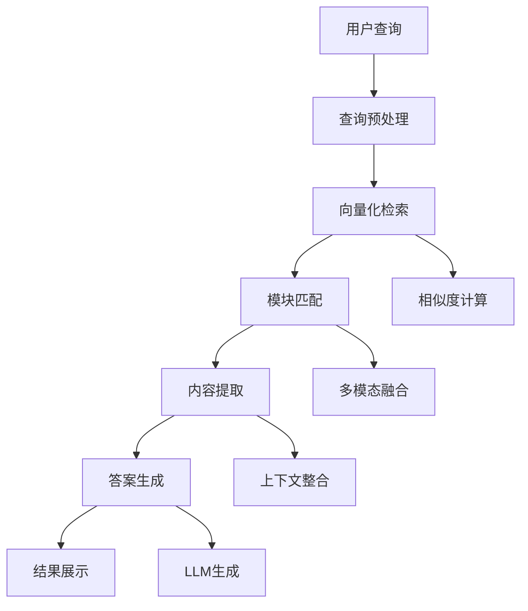

# 🧠 FigureYa RAG 智能生物医学分析助手

## 📊 数据规模分析

### 知识库概况
- **模块数量**: 300+ 个标准化R Markdown模板
- **文本文件**: 348 个已处理的txt文件
- **知识容量**: 108,632+ 行专业内容
- **覆盖领域**: 基因组学、转录组学、蛋白质组学、临床医学

### 数据结构
```
FigureYa/
├── chapters.json          # 模块索引和元数据
├── texts/                 # 348个处理后的文本文件
├── gallery_compress/      # 缩略图和视觉内容
└── FigureYaXXX/          # 300+ 个完整模块
    ├── FigureYaXXX.Rmd   # 主分析脚本
    ├── install_dependencies.R
    ├── easy_input_*.csv
    └── output_*.txt
```

## 🎯 RAG系统设计

### 1. 知识向量化策略

#### 分层向量化
```
Level 1: 模块级向量化 (Module Level)
├── 模块名称和功能描述
├── 输入数据类型
├── 输出可视化类型
└── 适用场景

Level 2: 内容级向量化 (Content Level)
├── 技术方法详解
├── 参数设置指导
├── 生物学意义解释
└── 使用注意事项

Level 3: 代码级向量化 (Code Level)
├── R代码片段
├── 关键函数说明
├── 数据处理流程
└── 可视化参数调整
```

#### 向量化维度
- **技术维度**: PCA、热图、生存分析、差异表达等
- **数据维度**: RNA-seq、ChIP-seq、单细胞、临床数据等
- **生物维度**: 癌症研究、免疫分析、信号通路等
- **应用维度**: 诊断标志物、预后分析、药物响应等

### 2. 智能检索功能

#### 用户查询类型
```
🔍 "我要做差异表达分析，应该用哪个FigureYa模块？"
🔍 "我有单细胞RNA-seq数据，如何做质量控制？"
🔍 "生存分析需要什么输入数据格式？"
🔍 "如何解释PCA分析结果的生物学意义？"
🔍 "批量RNA-seq数据标准化方法有哪些？"
```

#### 智能匹配策略
```
语义匹配 + 关键词匹配 + 数据类型匹配

示例查询: "肝癌TCGA数据差异表达分析"
↓
1. 语义理解: 癌症研究 + 基因表达差异
2. 数据类型匹配: TCGA + RNA-seq
3. 技术匹配: 差异表达分析
4. 推荐模块:
   - FigureYa59volcanoV2 (火山图)
   - FigureYa9heatmap (热图)
   - FigureYa34count2FPKMv2 (数据预处理)
```

### 3. RAG工作流程



## 🚀 系统架构

### 前端界面
```
智能问答界面
├── 对话式交互
├── 模块推荐卡片
├── 代码示例展示
├── 可视化预览
└── 相关模块推荐
```

### 后端服务
```
RAG Engine
├── 向量数据库 (Chroma/Pinecone)
├── 文本分割器 (RecursiveCharacterTextSplitter)
├── 嵌入模型 (text-embedding-ada-002/Sentence-BERT)
├── 检索器 (MultiQueryRetriever)
├── LLM (GPT-4/Claude/本地模型)
└── 知识库更新器
```

## 💡 核心功能

### 1. 智能模块推荐
- **数据类型匹配**: 根据输入数据格式推荐合适模块
- **分析目标匹配**: 根据研究目的推荐分析流程
- **技术栈匹配**: 考虑用户技术背景推荐复杂度

### 2. 参数优化建议
- **自动参数检测**: 基于数据特征推荐参数
- **最佳实践分享**: 提供领域专家的经验参数
- **结果解释指导**: 帮助理解参数对结果的影响

### 3. 分析流程设计
- **多模块串联**: 设计完整的分析流程
- **数据流指导**: 确保模块间的数据兼容性
- **质量控制**: 提供每步的数据质保建议

### 4. 结果解读帮助
- **统计学解释**: 解释p值、FDR等统计概念
- **生物学意义**: 连接分析结果与生物学机制
- **可视化解读**: 指导图表的生物学解读

## 📱 应用场景

### 场景1: 新手研究者
```
用户: "我是生信新手，有RNA-seq差异表达数据，不知道从哪里开始"
RAG回复:
├── 推荐入门模块: FigureYa59volcanoV2
├── 提供数据格式要求
├── 给出完整代码示例
└── 推荐学习路径
```

### 场景2: 数据类型转换
```
用户: "我有raw count数据，想做差异表达，但数据格式不对"
RAG回复:
├── 推荐预处理模块: FigureYa34count2FPKMv2
├── 说明转换必要性
├── 提供转换代码
└── 指导下游分析
```

### 场景3: 高级分析
```
用户: "要做单细胞数据的质量控制和聚类分析"
RAG回复:
├── 推荐单细胞专用模块组合
├── 提供质量控制指标
├── 指导参数选择
└── 展示预期结果
```

## 🔧 技术实现

### 向量化策略
```python
# 示例代码结构
from langchain.embeddings import OpenAIEmbeddings
from langchain.vectorstores import Chroma
from langchain.text_splitter import RecursiveCharacterTextSplitter

# 加载FigureYa知识库
def load_figureya_knowledge():
    texts = load_all_text_files("texts/")
    chapters = load_json("chapters.json")
    return texts, chapters

# 创建向量存储
def create_vector_store(texts):
    text_splitter = RecursiveCharacterTextSplitter(
        chunk_size=1000,
        chunk_overlap=200
    )
    chunks = text_splitter.split_texts(texts)

    embeddings = OpenAIEmbeddings()
    vectorstore = Chroma.from_texts(chunks, embeddings)
    return vectorstore
```

### 智能检索
```python
def figureya_rag_query(query, vectorstore):
    # 多查询检索
    retriever = MultiQueryRetriever.from_llm(
        llm=ChatOpenAI(),
        retriever=vectorstore.as_retriever()
    )

    # 检索相关文档
    docs = retriever.get_relevant_documents(query)

    # 生成答案
    chain = load_qa_chain(ChatOpenAI(), chain_type="stuff")
    result = chain.run(input_documents=docs, question=query)

    return result, docs
```

## 🎯 预期效果

### 效率提升
- **模块选择时间**: 从30分钟缩短到2分钟
- **参数调试时间**: 减少60%的试错时间
- **学习曲线**: 新手上手时间减少70%

### 质量保证
- **标准化流程**: 确保分析符合最佳实践
- **错误预防**: 提前发现常见错误
- **结果可信度**: 提供统计学和生物学双重验证

### 用户体验
- **智能对话**: 自然语言交互
- **可视化推荐**: 图表类型自动推荐
- **个性化**: 根据用户背景调整建议复杂度

## 🚀 下一步计划

1. **知识库预处理**: 向量化所有348个文本文件
2. **检索系统开发**: 实现多模态检索引擎
3. **前端界面构建**: 创建对话式问答界面
4. **测试优化**: 基于用户反馈持续改进
5. **部署上线**: 提供在线服务和本地部署版本

这个RAG系统将让FigureYa从"工具库"升级为"智能助手"，大大降低生物医学数据分析的门槛！